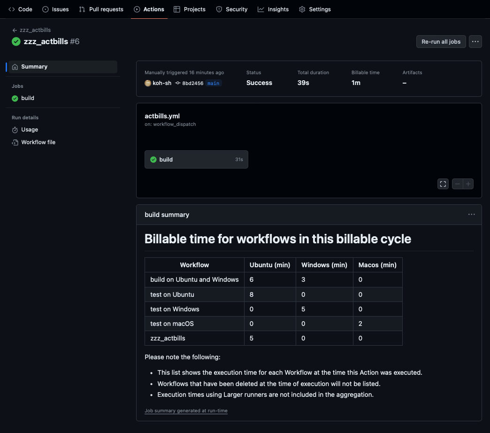

# actbills

This GitHub Action generates a markdown table of billable execution times for each workflow in a private GitHub repository. It provides an easy way to track and monitor the usage and costs associated with your GitHub Actions workflows.

> [!WARNING]
> - GitHub Actions is free for public repositories. This action is only applicable to private repositories.
> - Execution times using Larger runners are not included in the aggregation.



# Features

- Retrieves the billable execution times for each workflow in a private repository
- Generates a markdown table summarizing the billable times for each workflow
- Helps track and monitor the usage and costs associated with GitHub Actions workflows

# Usage

To use this GitHub Action in your repository, follow these steps:

1. Create a new file named .github/workflows/actbills.yml in your repository.
2. Copy and paste the following YAML configuration into the actbills.yml file:

```yaml
name: zzz_actbills

# run daily or dispatch.
# fix schedule for your needs
on:
  schedule:
    - cron: '0 0 * * *'
  workflow_dispatch:

# This action requires actions:read permission
permissions:
  actions: read

jobs:
  build:
    runs-on: ubuntu-latest
    steps:
      - uses: koh-sh/actbills@v0
```

3. The schedule trigger is set to run the action daily at 00:00 AM UTC. You can modify the cron expression to adjust the schedule based on your requirements.
4. The workflow_dispatch trigger allows you to manually run the action whenever needed.
5. Commit and push the changes to your repository.
6. After the action runs successfully, the markdown table with billable execution times will be generated and included in the action's summary.

# Output
The generated markdown table will have the following format:

| Workflow | Ubuntu (min) | Windows (min) | Macos (min) |
| --- | --- | --- | --- |
| build on Ubuntu and Windows | 6 | 3 | 0 |
| test on Ubuntu | 8 | 0 | 0 |
| test on Windows | 0 | 5 | 0 |
| test on macOS | 0 | 0 | 2 |
| zzz_actbills | 6 | 0 | 0 |

The table will include the name of each workflow and its corresponding billable execution time in minutes.
